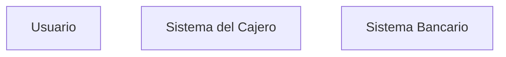

## **Resumen de Actores**

| **Actor**               | **Descripción**                                                                 |
|--------------------------|---------------------------------------------------------------------------------|
| **Usuario**              | Cliente del banco que realiza operaciones en el cajero automático.              |
| **Sistema del cajero**   | Software y hardware del cajero que procesa las transacciones.                   |
| **Sistema bancario**     | Sistema central del banco que valida y registra las transacciones.              |

---

### **Notas**
- El **Actor Primario** es siempre el usuario, ya que es quien inicia y realiza las operaciones.
- Los **Actores Secundarios** son sistemas que interactúan con el cajero para validar y procesar las transacciones.