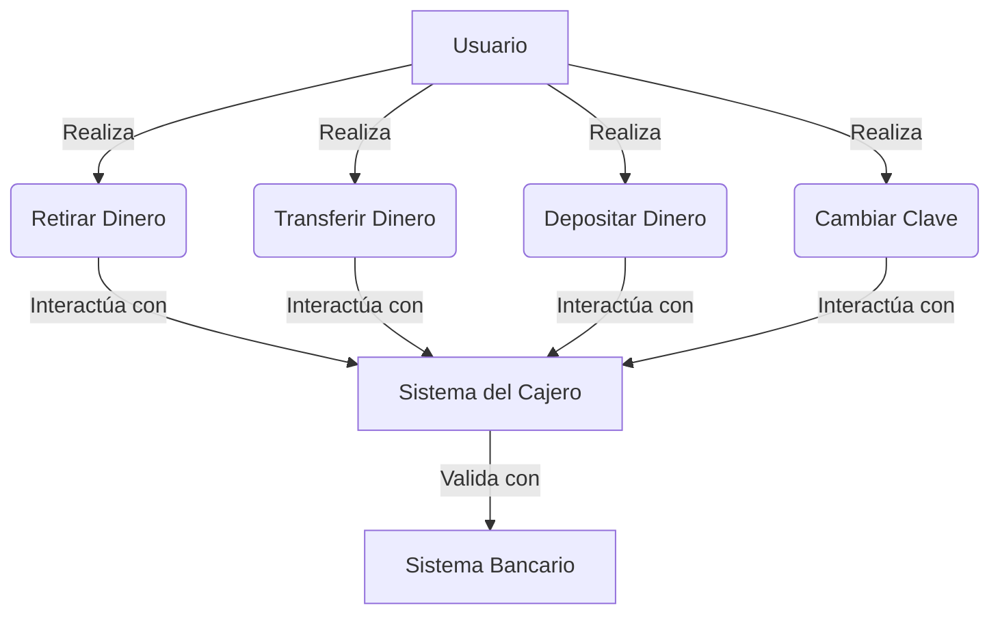

# Inicio

```mermaid
graph TD
    A[Usuario] -->|Realiza| B(Retirar Dinero)
    A -->|Realiza| C(Transferir Dinero)
    A -->|Realiza| D(Depositar Dinero)
    A -->|Realiza| E(Cambiar Clave)
    B -->|Interactúa con| F[Sistema del Cajero]
    C -->|Interactúa con| F
    D -->|Interactúa con| F
    E -->|Interactúa con| F
    F -->|Valida con| G[Sistema Bancario]
```